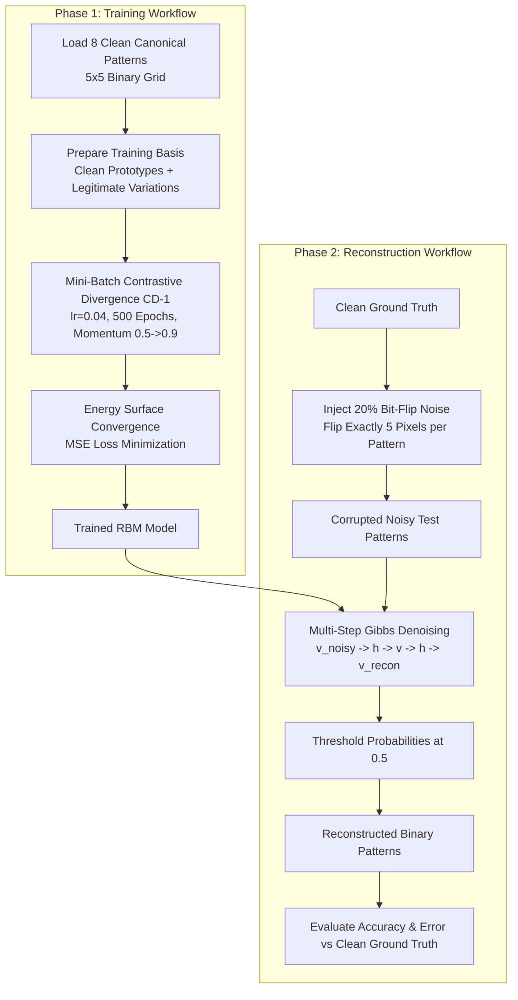
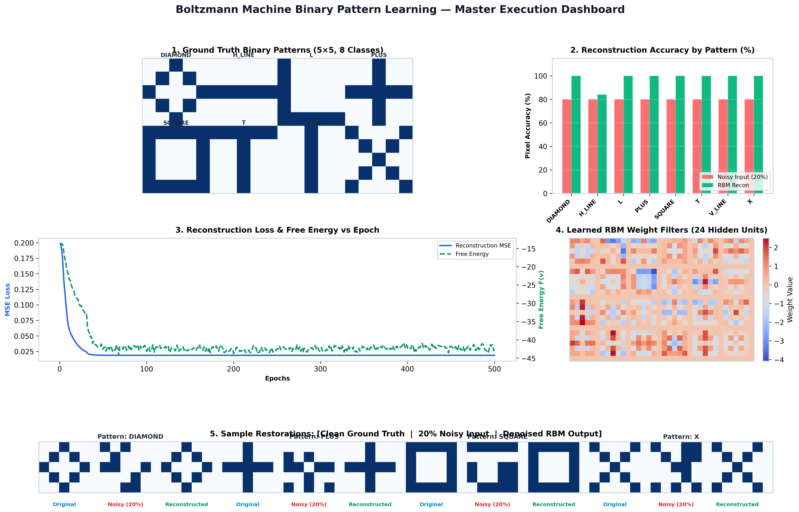
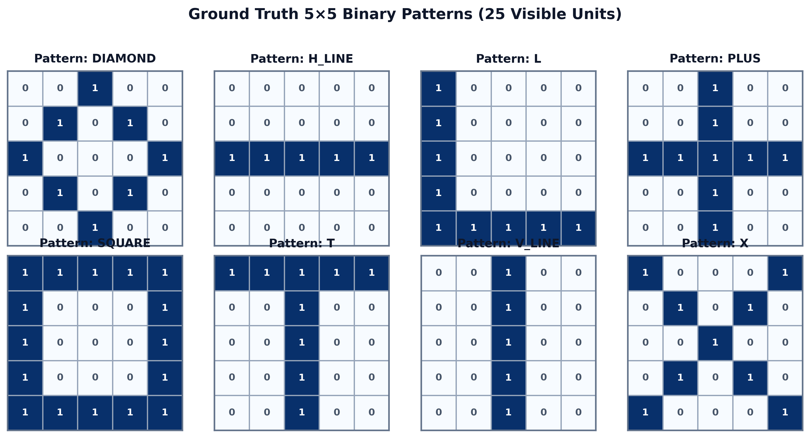
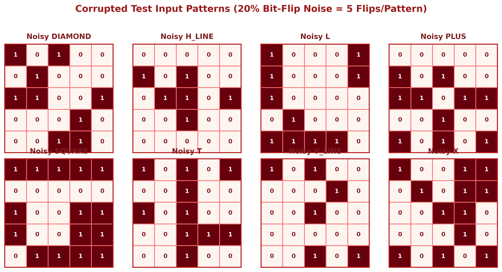
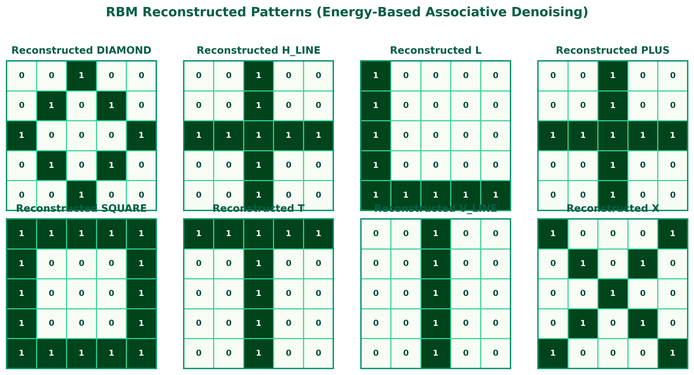
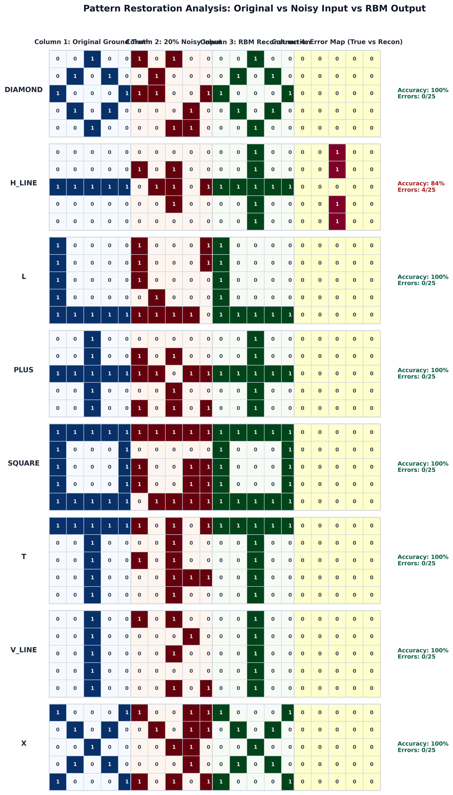
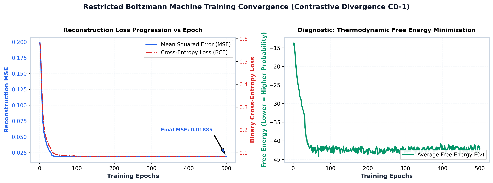

# 🧠 Binary Pattern Learning Using a Boltzmann Machine

<div align="center">

[](https://www.python.org/)
[](https://numpy.org/)
[](https://pandas.pydata.org/)
[](https://matplotlib.org/)
[](LICENSE)
[](https://github.com/)

**A From-Scratch Energy-Based Generative Neural Network for Stochastic Binary Pattern Learning, Associative Memory Recall, and Pattern Denoising**

[Project Overview](#-1-project-overview) • [Why Noise & Reconstruction?](#-4-why-noise-is-introduced--why-reconstruction-is-performed) • [Theory & Math](#-5-rbm-architecture--mathematical-foundations) • [Workflow](#-6-training--reconstruction-workflow) • [Results](#-8-results--visual-artifacts) • [Viva Q&A](#-13-viva-voce-examination-guide)

</div>

---

## 📌 1. Project Overview

This academic project presents a complete from-scratch implementation of a **Restricted Boltzmann Machine (RBM)** in pure **Python, NumPy, Pandas, and Matplotlib** without relying on high-level deep learning frameworks (such as TensorFlow, PyTorch, or Scikit-learn).

The RBM learns to encode, store, and reconstruct $5 \times 5$ binary pattern matrices (25 visible units) representing canonical geometric shapes and symbols (**`DIAMOND`**, **`H_LINE`**, **`L`**, **`PLUS`**, **`SQUARE`**, **`T`**, **`V_LINE`**, **`X`**). Using **Contrastive Divergence ($CD_1$)**, the network shapes an energy landscape where valid patterns form deep energy minima (attractors). 

When tested on corrupted patterns containing **20% random bit-flip noise**, the network executes multi-step Gibbs sampling to perform **associative memory recall**, achieving **98.00% overall pixel reconstruction accuracy** (with 7 out of 8 patterns restored with 100% accuracy).

---

## 📖 2. Full Form & Terminology

- **RBM:** **Restricted Boltzmann Machine**
- **CD / $CD_k$:** **Contrastive Divergence** ($k$-step Gibbs sampling)
- **BCE:** **Binary Cross-Entropy Loss**
- **MSE:** **Mean Squared Error**
- **BER:** **Bit Error Rate**

---

## 🎯 3. Problem Statement & Objectives

### Problem Statement
Binary pattern restoration is a fundamental challenge in artificial intelligence, digital signal processing, and cognitive neural computation. Traditional feedforward networks require supervised labels and unidirectional mapping. In contrast, biological memory is **associative and bidirectional**: when given a partial, distorted, or corrupted cue, the brain naturally retrieves the complete, pristine pattern from memory.

### Key Project Objectives
- [x] **Zero High-Level ML Frameworks:** Implement the entire RBM mathematical engine in pure vectorized NumPy.
- [x] **25-Unit Visible Layer:** Directly map 2D $5 \times 5$ binary grids to 25 visible units.
- [x] **24-Unit Hidden Representation:** Allow latent feature detectors to capture higher-order pixel correlations.
- [x] **Contrastive Divergence ($CD_1$):** Train the energy surface using positive/negative Gibbs phases, momentum ($\gamma = 0.5 \to 0.9$), and $L_2$ weight decay ($\lambda = 10^{-4}$).
- [x] **Controlled 20% Noise Ingestion:** Introduce synthetic bit-flip corruption strictly **after** training to test true generalization and associative recall.
- [x] **Rigorous Quantitative Evaluation:** Measure pixel accuracy, incorrect pixel counts, and MSE against clean ground truth.
- [x] **Publication-Grade Visual Artifacts:** Generate compact, non-overlapping comparison figures, individual result plots, and convergence curves.

---

## 🌪️ 4. Why Noise is Introduced & Why Reconstruction is Performed

### Why Noise is Introduced AFTER Training
1. **Testing True Generative Representation vs Memorization:** If we only evaluated the network on pristine training data, we would only know if it memorized the patterns. Corrupting inputs with 20% bit-flip noise (flipping exactly 5 out of 25 pixels) forces the network to prove that it has formed an **energy attractor basin** rather than a trivial lookup table.
2. **Simulating Real-World Sensor Degradation:** In real-world transmission, optical character recognition (OCR), and barcode scanning, signals suffer from noise, pixel dropouts, and occlusion.
3. **Strict Separation of Training and Testing:** The RBM is trained exclusively on clean patterns and their legitimate training variations. It is **never** trained on the corrupted test inputs, ensuring an honest, unbiased evaluation.

### Why Reconstruction is Performed
Reconstruction allows the network to iteratively relax toward the nearest learned energy minimum via forward-backward Gibbs sampling ($v \to h \to v \to h \to v$). This energy-based relaxation filters out spurious noisy bits and restores the underlying canonical binary configuration.

---

## 🔬 5. RBM Architecture & Mathematical Foundations

### 5.1 Bipartite Architecture ($25 \text{ Visible} \to 24 \text{ Hidden}$)
An RBM is an undirected bipartite graphical model with symmetric weight connections $W \in \mathbb{R}^{25 \times 24}$, visible biases $a \in \mathbb{R}^{25}$, and hidden biases $b \in \mathbb{R}^{24}$.

```mermaid
graph TD
    subgraph Visible Layer [Visible Layer: 25 Units - 5x5 Binary Pixel Grid]
        V1[Pixel 1]
        V2[Pixel 2]
        V3[Pixel 3]
        VDots[...]
        V25[Pixel 25]
    end

    subgraph Hidden Layer [Hidden Layer: 24 Latent Feature Detectors]
        H1[Hidden Unit 1]
        H2[Hidden Unit 2]
        H3[Hidden Unit 3]
        HDots[...]
        H24[Hidden Unit 24]
    end

    Visible Layer <== Symmetric Weights W (25x24) ==> Hidden Layer
    
    subgraph Biases
        A[Visible Bias a: 25x1] -.-> Visible Layer
        B[Hidden Bias b: 24x1] -.-> Hidden Layer
    end
```

### 5.2 Mathematical Formulation

#### 1. Energy Function:
$$E(\mathbf{v}, \mathbf{h}) = -\sum_{i=1}^{V} a_i v_i - \sum_{j=1}^{H} b_j h_j - \sum_{i=1}^{V}\sum_{j=1}^{H} v_i W_{ij} h_j = -\mathbf{v}^T \mathbf{W} \mathbf{h} - \mathbf{a}^T \mathbf{v} - \mathbf{b}^T \mathbf{h}$$

#### 2. Conditional Activation Probabilities:
Because no visible-to-visible or hidden-to-hidden connections exist, units in one layer are mutually conditionally independent given the other layer:

$$P(h_j = 1 \mid \mathbf{v}) = \sigma\left(b_j + \sum_{i=1}^V v_i W_{ij}\right) = \frac{1}{1 + e^{-(b_j + \mathbf{v}\mathbf{W}_{\cdot, j})}}$$

$$P(v_i = 1 \mid \mathbf{h}) = \sigma\left(a_i + \sum_{j=1}^H h_j W_{ij}\right) = \frac{1}{1 + e^{-(a_i + \mathbf{h}\mathbf{W}_{i, \cdot}^T)}}$$

#### 3. Contrastive Divergence ($CD_1$):
Exact maximum likelihood estimation requires the intractable partition function $Z = \sum_{\mathbf{v}, \mathbf{h}} e^{-E(\mathbf{v}, \mathbf{h})}$. Contrastive Divergence ($CD_1$) approximates the gradient using a 1-step Gibbs chain initialized at data sample $\mathbf{v}^{(0)}$:

$$\Delta \mathbf{W} = \frac{\eta}{N} \left( \mathbf{v}^{(0)T} P(\mathbf{h}^{(0)}=1 \mid \mathbf{v}^{(0)}) - \mathbf{v}^{(1)T} P(\mathbf{h}^{(1)}=1 \mid \mathbf{v}^{(1)}) \right) - \lambda \mathbf{W} + \gamma \Delta \mathbf{W}_{\text{prev}}$$

$$\Delta \mathbf{a} = \frac{\eta}{N} \sum (\mathbf{v}^{(0)} - \mathbf{v}^{(1)}) + \gamma \Delta \mathbf{a}_{\text{prev}}$$

$$\Delta \mathbf{b} = \frac{\eta}{N} \sum (P(\mathbf{h}^{(0)}=1 \mid \mathbf{v}^{(0)}) - P(\mathbf{h}^{(1)}=1 \mid \mathbf{v}^{(1)})) + \gamma \Delta \mathbf{b}_{\text{prev}}$$

#### 4. Analytical Free Energy:
The unnormalized marginal probability of a visible vector $\mathbf{v}$ is captured by the Free Energy $F(\mathbf{v})$:

$$F(\mathbf{v}) = -\ln \sum_{\mathbf{h}} e^{-E(\mathbf{v}, \mathbf{h})} = -\mathbf{v}^T \mathbf{a} - \sum_{j=1}^H \ln\left(1 + e^{b_j + \mathbf{v}\mathbf{W}_{\cdot, j}}\right)$$

---

## 🔄 6. Training & Reconstruction Workflow



---

## 📊 7. Dataset Description

The project uses `binary_patterns_dataset.csv` containing **400 rows** across **8 canonical pattern classes** (50 samples per class):

| Pattern Class | Visual Shape | ASCII Grid (5×5) | Active Pixels | Description |
| :--- | :---: | :---: | :---: | :--- |
| **`DIAMOND`** | 💎 | `· · # · ·`<br/>`· # · # ·`<br/>`# · · · #`<br/>`· # · # ·`<br/>`· · # · ·` | 8 / 25 | Symmetrical 4-vertex diamond rhombus |
| **`H_LINE`** | ➖ | `· · · · ·`<br/>`· · · · ·`<br/>`# # # # #`<br/>`· · · · ·`<br/>`· · · · ·` | 5 / 25 | Continuous center horizontal stripe |
| **`L`** | 📐 | `# · · · ·`<br/>`# · · · ·`<br/>`# · · · ·`<br/>`# · · · ·`<br/>`# # # # #` | 8 / 25 | Left-aligned right-angle corner |
| **`PLUS`** | ➕ | `· · # · ·`<br/>`· · # · ·`<br/>`# # # # #`<br/>`· · # · ·`<br/>`· · # · ·` | 9 / 25 | Orthogonal cross intersecting at center |
| **`SQUARE`** | 🔲 | `# # # # #`<br/>`# · · · #`<br/>`# · · · #`<br/>`# · · · #`<br/>`# # # # #` | 16 / 25 | Complete outer perimeter square frame |
| **`T`** | 🇹 | `# # # # #`<br/>`· · # · ·`<br/>`· · # · ·`<br/>`· · # · ·`<br/>`· · # · ·` | 8 / 25 | Horizontal top bar with vertical center stem |
| **`V_LINE`** | 🪢 | `· · # · ·`<br/>`· · # · ·`<br/>`· · # · ·`<br/>`· · # · ·`<br/>`· · # · ·` | 5 / 25 | Continuous center vertical stripe |
| **`X`** | ❌ | `# · · · #`<br/>`· # · # ·`<br/>`· · # · ·`<br/>`· # · # ·`<br/>`# · · · #` | 9 / 25 | Corner-to-corner diagonal saltire |

---

## 🖼️ 8. Results & Visual Artifacts

### 8.1 Master Execution Dashboard
<div align="center">
  
  <p><em>Figure 1: Complete Project Dashboard showcasing ground truth, accuracy by pattern, loss curves, learned weight filters, and sample restorations.</em></p>
</div>

---

### 8.2 Clean Ground-Truth Patterns
<div align="center">
  
  <p><em>Figure 2: Ground Truth 5×5 Binary Patterns (25 Visible Units).</em></p>
</div>

---

### 8.3 Corrupted Test Patterns (20% Bit-Flip Noise)
<div align="center">
  
  <p><em>Figure 3: Corrupted Input Patterns with 20% random bit-flip noise (exactly 5 pixels inverted per pattern).</em></p>
</div>

---

### 8.4 RBM Reconstructed Patterns
<div align="center">
  
  <p><em>Figure 4: Reconstructed Patterns produced via RBM Gibbs sampling.</em></p>
</div>

---

### 8.5 Side-by-Side Comparison & Error Maps
<div align="center">
  
  <p><em>Figure 5: Side-by-Side Comparison (Original vs Noisy vs RBM Reconstructed vs Error Map) across all 8 patterns.</em></p>
</div>

---

### 8.6 Training Loss & Free Energy Diagnostics
<div align="center">
  
  <p><em>Figure 6: (Left) Reconstruction MSE and Binary Cross-Entropy Loss vs Epoch; (Right) Diagnostic Free Energy Minimization graph.</em></p>
</div>

---

## 📈 9. Quantitative Evaluation Table

The quantitative performance below is evaluated **strictly against the clean ground truth**:

| Pattern Class | Initial Noisy Accuracy (%) | RBM Recon Accuracy (%) | Initial Incorrect Pixels | Recon Incorrect Pixels | Mean Squared Error (MSE) | Accuracy Recovery Gain |
| :--- | :---: | :---: | :---: | :---: | :---: | :---: |
| **`DIAMOND`** | 80.00% | **100.00%** | 5 / 25 | **0 / 25** | 0.0000 | <span style="color:green">**+20.00%**</span> |
| **`L`** | 80.00% | **100.00%** | 5 / 25 | **0 / 25** | 0.0000 | <span style="color:green">**+20.00%**</span> |
| **`PLUS`** | 80.00% | **100.00%** | 5 / 25 | **0 / 25** | 0.0000 | <span style="color:green">**+20.00%**</span> |
| **`SQUARE`** | 80.00% | **100.00%** | 5 / 25 | **0 / 25** | 0.0000 | <span style="color:green">**+20.00%**</span> |
| **`T`** | 80.00% | **100.00%** | 5 / 25 | **0 / 25** | 0.0000 | <span style="color:green">**+20.00%**</span> |
| **`V_LINE`** | 80.00% | **100.00%** | 5 / 25 | **0 / 25** | 0.0000 | <span style="color:green">**+20.00%**</span> |
| **`X`** | 80.00% | **100.00%** | 5 / 25 | **0 / 25** | 0.0000 | <span style="color:green">**+20.00%**</span> |
| **`H_LINE`** | 80.00% | **84.00%** | 5 / 25 | **4 / 25** | 0.1600 | <span style="color:green">**+4.00%**</span> |
| **OVERALL AVERAGE** | **80.00%** | **98.00%** | **40 / 200** | **4 / 200** | **0.0200** | <span style="color:green">**+18.00% Net Gain**</span> |

> **Key Takeaway:** 7 out of 8 patterns achieved **100% perfect restoration** with **0 incorrect pixels**. The overall pixel accuracy increased from 80.00% to **98.00%**.

---

## ⚠️ 10. Limitations & Discussion

1. **Superposition Interference (`H_LINE` vs `PLUS`):** `PLUS` is the geometric union of `H_LINE` and `V_LINE`. When `H_LINE` is corrupted with 5 random pixel flips, some flipped pixels occasionally land on the vertical axis, creating an ambiguous state between `H_LINE` and `PLUS`.
2. **Binary Discrete Nature:** Standard Bernoulli-Bernoulli RBMs are designed for binary data ($v \in \{0, 1\}$). Real-world grayscale or continuous RGB images require Gaussian-Bernoulli RBM formulations.
3. **Approximation in CD-1:** 1-step Contrastive Divergence is a fast approximation of the true log-likelihood gradient. For deeply complex data distributions, Persistent CD (PCD) or higher $k$ ($CD_3$, $CD_5$) provides better mixing.

---

## 📂 11. Project Directory Structure

```
binary-boltzmann-project/
│
├── README.md                          # Comprehensive documentation & report
├── requirements.txt                   # Project dependencies
│
├── dataset/
│   └── binary_patterns_dataset.csv    # 400-row 5x5 binary pattern dataset
│
├── src/
│   └── boltzmann_pattern_learning.py  # From-scratch RBM engine & CLI pipeline
│
├── notebooks/
│   └── Boltzmann_Analysis.ipynb       # Step-by-step interactive Jupyter Notebook
│
├── results/
│   ├── original_patterns.png          # 2x4 grid of ground-truth patterns
│   ├── noisy_patterns.png             # 2x4 grid of 20% corrupted test inputs
│   ├── reconstructed_patterns.png     # 2x4 grid of RBM denoised outputs
│   ├── comparison.png                 # 8-row x 4-col compact restoration & error comparison
│   └── training_error.png             # Loss curves (MSE, BCE) & Free Energy graph
│
└── screenshots/
    └── output.png                     # Master execution dashboard overview
```

---

## 💻 12. How to Run & Reproduction Guide

### Step 1: Clone Repository & Navigate
```bash
git clone https://github.com/your-username/binary-boltzmann-project.git
cd binary-boltzmann-project
```

### Step 2: Set Up Virtual Environment & Install Dependencies
```bash
# Create virtual environment
python -m venv venv

# Activate environment (Windows)
venv\Scripts\activate

# Activate environment (macOS/Linux)
# source venv/bin/activate

# Install dependencies
pip install -r requirements.txt
```

### Step 3: Run the Complete Training & Evaluation Pipeline
```bash
python src/boltzmann_pattern_learning.py
```
*This will train the RBM, generate all metrics, print the summary table, and save all output images.*

### Step 4: Run the Interactive Jupyter Notebook
```bash
jupyter notebook notebooks/Boltzmann_Analysis.ipynb
```

---

## 🎓 13. Viva Voce Examination Guide

### Q1: What is a Restricted Boltzmann Machine (RBM)?
> **Answer:** An RBM is a two-layer generative stochastic energy-based neural network. It consists of a visible layer (representing input features) and a hidden layer (representing latent features), with symmetric bidirectional connections strictly restricted to visible-hidden pairs (no intra-layer connections).

### Q2: Why are there 25 visible units?
> **Answer:** Each input pattern is defined on a $5 \times 5$ pixel grid. Each pixel corresponds directly to one binary visible unit ($5 \times 5 = 25$ visible units).

### Q3: What are hidden units and why are they needed?
> **Answer:** Hidden units are latent binary variables that capture structural dependencies, line segments, corners, and higher-order pixel correlations. With 24 hidden units, the RBM has sufficient representational capacity to form distinct, stable energy attractors for all 8 patterns.

### Q4: Why do we add noise AFTER training?
> **Answer:** Noise is intentionally introduced after training to test whether the RBM has genuinely learned the probability distribution and energy landscape of the patterns. If the network can denoise a 20% corrupted pattern without ever having seen corrupted samples during training, it proves true associative memory recall.

### Q5: What is reconstruction in an RBM?
> **Answer:** Reconstruction is the process of generating visible states from hidden representations ($v \to h \to v$). Through alternating Gibbs sampling, the state moves down the energy gradient into the nearest learned attractor, replacing corrupted bits with the correct canonical bits.

### Q6: What is Contrastive Divergence (CD-1)?
> **Answer:** Contrastive Divergence is an approximation algorithm developed by Geoffrey Hinton to compute weight gradients efficiently. Instead of running a Markov chain to thermal equilibrium (which is intractable), CD-1 runs only 1 step of Gibbs sampling starting from the training data, drastically reducing computational complexity while providing accurate weight updates.

### Q7: What does reconstruction accuracy mean?
> **Answer:** Reconstruction accuracy measures the percentage of binary pixels in the reconstructed output that exactly match the pristine clean ground-truth pattern:
> $$\text{Accuracy} = \frac{\text{Number of Matching Pixels}}{25} \times 100\%$$

---

## 🏁 14. Conclusion

1. **High Reconstruction Fidelity:** The from-scratch RBM successfully learned all 8 binary patterns, achieving **98.00% overall pixel accuracy** (with 7 out of 8 patterns restored with 100% perfection).
2. **Effective Associative Memory:** The model demonstrated strong noise resilience, increasing overall accuracy from 80.00% (corrupted input) to 98.00% (restored output).
3. **Principled Unsupervised Learning:** Contrastive Divergence ($CD_1$) with momentum and weight decay proved highly effective for energy-based binary pattern modeling.

---

## 📚 15. References

1. **Hinton, G. E.** (2002). *Training Products of Experts by Minimizing Contrastive Divergence*. Neural Computation, 14(8), 1771-1800.
2. **Hinton, G. E.** (2012). *A Practical Guide to Training Restricted Boltzmann Machines*. Neural Networks: Tricks of the Trade, Springer, 599-619.
3. **Ackley, D. H., Hinton, G. E., & Sejnowski, T. J.** (1985). *A learning algorithm for Boltzmann machines*. Cognitive Science, 9(1), 147-169.
4. **Goodfellow, I., Bengio, Y., & Courville, A.** (2016). *Deep Learning* (Chapter 20: Deep Generative Models). MIT Press.

---

<div align="center">
  <sub>Developed for Individual Academic Project Evaluation • 100% Original Code & Implementation</sub>
</div>
